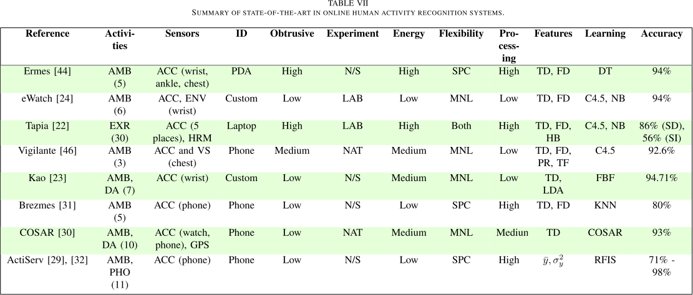
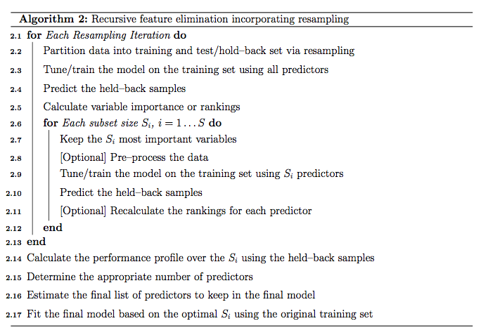

\pagebreak

## Objective

Sensor data is all around us. From the Gartner website [gartner]:
>The Internet of Things (IoT), which excludes PCs, tablets and smartphones, will grow to 26 billion units installed in 2020 representing an almost 30-fold increase from 0.9 billion in 2009, according to Gartner, Inc. Gartner said that IoT product and service suppliers will generate incremental revenue exceeding $300 billion, mostly in services, in 2020. It will result in $1.9 trillion in global economic value-add through sales into diverse end markets.
The ability to make sense of the data streaming from all these new devices is a key aspect of the growth in this industry.

The UCI dataset, "Human Activity Recognition Using Smartphones Data Set" [uci] is "built from the recordings of 30 subjects performing activities of daily living (ADL) while carrying a wasit-mounted smartphone with embedded inertial sensors." Our goal is to be able to predict user activity based on that sensor data.

From IEEE [har], there is a paper surveying state-of-the-art performance in HAR (Human Activity Recogintion).  Table VII performance measurements for several model techniques:



Our goal will be to test <font color='red'>${\LARGE XX}$</font> models against these data and compare that against the table presented above. We will also discuss the steps and choices involved in cleaning the data, feature selection, model tuning, and final model selection.

## Background Information

From the data dictionary:

> The sensor signals (accelerometer and gyroscope) were pre-processed by applying noise filters and then sampled in fixed-width sliding windows of 2.56 sec and 50% overlap (128 readings/window). The sensor acceleration signal, which has gravitational and body motion components, was separated using a Butterworth low-pass filter into body acceleration and gravity. The gravitational force is assumed to have only low frequency components, therefore a filter with 0.3 Hz cutoff frequency was used. From each window, a vector of features was obtained by calculating variables from the time and frequency domain. See 'features_info.txt' for more details. 

This means that we are not dealing with time domain vectors. Each observation represents 561 measurements of a 2.56 second window. We will attempt to ascertain what activity the user was engaged in from this 2.56 second observation.


## Environment / Dependencies

### Dependencies
```{r dependencies, warning=FALSE, message=FALSE}
library(knitr)
# Suppress messages and warnings in all chuncks
opts_chunk$set(message=FALSE, warning=FALSE)

# Libraries
library(caret)
library(randomForest)
library(liso)

# Processing
library(doParallel)
registerDoParallel(cores = 4)

```


### Working Directory / File Paths

```{r environment}
## Working Directory
proj_dir <- "IS624_Final_Project"
if(basename(getwd()) == proj_dir){
  setwd("./code")
}

if(!(basename(getwd()) == "code")){
  break
}

## File Paths
dataDir <- "../data"
trainDataDir <- file.path(dataDir, "UCI HAR Dataset", "train")
testDataDir <- file.path(dataDir, "UCI HAR Dataset", "test")
```

### Custom Functions

```{r custom_functions}

## timing function
time.stamp <- function(split.times=list(), label=""){
  n <- length(split.times)
  current.time <- Sys.time()
  
  if (n == 0){
    split.times[[1]] <- list(kickoff=current.time,
                             laptime=0,
                             overall=0,
                             label=paste("kickoff at ", current.time),
                             index=1)
  } else {
    runtime = as.numeric(current.time - split.times[[1]]$kickoff, units="mins")
    split.times[[n + 1]] <- list(laptime=runtime - split.times[[n]]$overall,
                                 overall=runtime,
                                 label=label,
                                 index=n + 1)
  }
  return(split.times)
}

parse.tstamp <- function(split.times, what="all"){
  df <- data.frame(overall=unlist(lapply(split.times, "[[", "overall")),
                   laptime=unlist(lapply(split.times, "[[", "laptime")),
                   label=  unlist(lapply(split.times, "[[", "label")))
  if (what == "last"){
    return (df[nrow(df),])
  }
  return(df)
}

## Stratify based on activity and subject
returnStratIndex <- function(activity, subject, times=1, p=0.5){
  index <- 1:length(activity)
  indexlist <- list()
  for (s in levels(subject)){
    subfilter <- s == subject
    stratindex <- createDataPartition(activity[subfilter], times=times, p=p)
    df <- data.frame(lapply(stratindex, function(x) {index[subfilter][x]}))
    indexlist[[length(indexlist) + 1]] <- df
  }
  return(do.call(rbind, indexlist))
}

```


## Data Partitioning

According to the file README.txt, the data was randomly partitioned into two sets where 70% of the volunteers were selected for generating the training data and 30% the test data. Splitting the data this way, by volunteer, is  a good idea in that we want our algorithm to be general enough to work from person to person, not just be good at identifying activities of a particular person. This would offer a good starting point for a device of this type. After it is purchased, it might make sense to tune the parameters to the specific person. We will tune all our models on the training set, and then run a final comparison on the test set.


## Load Training Data

```{r train_data}
## Sensor Data
df.sns <- read.csv(file.path(trainDataDir, "X_train.txt"), 
                     header=FALSE, sep="")
snsColNums <- 1:ncol(df.sns)

features <- readLines(file.path(dataDir, "UCI HAR Dataset", "features.txt"))

## Subject ID
sub <- as.factor(readLines(file.path(trainDataDir, "subject_train.txt")))

## Activity ID
act <- as.factor(readLines(file.path(trainDataDir, "y_train.txt")))
```

## Load Test Data

```{r test_data}
## Sensor Data
df.sns.test <- read.csv(file.path(testDataDir, "X_test.txt"), 
                        header=FALSE, sep="")
# snsColNums <- 1:ncol(df.sns)

## Subject ID
sub.test <- as.factor(readLines(file.path(testDataDir, "subject_test.txt")))

## Activity ID
act.test <- as.factor(readLines(file.path(testDataDir, "y_test.txt")))
```

## Data Cleaning

The sensor data is numeric with no missing values. The activity index and subject vectors were read in as factors, which is appropriate. Other than that, no cleaning is necessary.

## Models

We will use the following models:

* Random Forest (rf)
* Neural Network (nnet)
* Gradient Boosting Machine (gbm)

Each model will go through the following steps:

* Correlated Predictors: Discuss the effect of correlated predictors and decide to remove them or not.
* Feature Selection: Do we get better model performance with fewer features? How do we decide which features to remove?
* Pre-Processing of Features: Does the model require features to be pre-processed or transformed in any way?
* Training Parameters: What model parameters do we use and how do we select them?
* Discussion of results: How was the accuracy measured?

### Common Methodology

The caret package has a nice tool for feature selection (rfe) that implements the algorithem shown below:



### Random Forest

#### Correlated Predictors

```{r}
## Correlated Variables
corCutoff <- 0.99
corMatrix <- cor(df.sns)
corFilter <- findCorrelation(corMatrix, corCutoff)
```

We see that at a cutoff of `r corCutoff` we have `r length(corFilter)` correlated predictors. This is very high, but probably not very surprising, as many of these features have been engineered from a smaller number of sensor readings.

#### Feature Selection

There is downturn 

For each model, need to evaluate performance based on test set

```{r}
timer <- time.stamp()
# Filter observations based on stratified sample of subjects
subFilter <- returnStratIndex(act, sub, times=2, p=0.15)
df.train <- df.sns[subFilter[,1],]
act.train <- act[subFilter[,1]]
df.test <- df.sns[subFilter[,2],]
act.test <- act[subFilter[,2]]

# Remove correlated cols
cutoff <- 0.999
corMatrix <- cor(df.sns[subFilter, ])
coltoremove <- findCorrelation(corMatrix, cutoff=cutoff)
df.train <- df.train[, -coltoremove]

# Vector for feature elimination
n <- ncol(df.train)
subsets <- as.integer(seq.log(10, n, length.out=5))

# Cross validation parameters
trControl <- trainControl(method="repeatedcv", 
                          repeats=3, number=5)
timer <- time.stamp(timer, "setup model parameters")
print (parse.tstamp(timer, "last"))

first = TRUE
model.list <- list()
df.train.i <- df.train
for (ss in subsets[order(subsets, decreasing=TRUE)]){
  # subset features
  if(!first){
    df.train.i <- df.train[,impCols[1:ss]]
  }
  
  # train model
  model.rf <- train(df.train.i, act.train,
                    trControl=trControl,
                    method="rf", ntrees=1000,
                    importance=FALSE)
#   model.list[[length(model.list) + 1]] <- list(subset=ss,
  model.list[[as.character(ss)]] <- list(subset=ss,
                                               model=model.rf)
  
  # If first time, calc varImp
  if(first){
    vimp <- varImp(model.rf)
    impCols <- order(vimp$importance$Overall, decreasing=TRUE)
    first=FALSE
  }
  
  # Heartbeat
  timer <- time.stamp(timer, paste("train", length(model.list)))
  print(parse.tstamp(timer, "last"))
}

lapply(lapply(model.list, "[[", "model"), function(x) {x$results})

df.results <- rbind(df.results, distillResults(model.list, cutoff))
plot(df.results, col=as.factor(df.results$cutoff), pch=19)
```

```{r}
distillResults <- function(model.list, cutoff){
  x <- unlist(lapply(model.list, "[[", "subset"))
  y <- unlist(lapply(lapply(model.list, "[[", "model"), 
                     function(x) {
                       rslts <- x$results$Accuracy
                       return(max(rslts))
                     }))
  return (data.frame(x=x, y=y, cutoff=cutoff))
}


```

```{r}
plotAcc <- function(df.results){
  first <- TRUE
  counter <- 1
  uniq.cutoffs <- unique(df.results$cutoff)
  for (c in uniq.cutoffs){
    df <- df.results[df.results$cutoff == c,]
    if(first){
      plot(df$x, df$y, 
           xlim=c(0, 565), ylim=c(0, 1), 
           xlab="Num Features", ylab="Accuracy",
           type='p', pch=19, col=counter)
      first <- FALSE
    } else{
      points(df$x, df$y, type='p', pch=19, col=counter)
    }
    counter <- counter + 1
  }
  legend("bottomright", col=c(1:length(uniq.cutoffs)), lwd=2,
         legend=uniq.cutoffs)
}
```

```{r}
plotAcc(df.results)
```


#### Pre-Processing

#### Training Parameters

#### Discussion of Results


### Neural Network

#### Correlated Predictors

#### Feature Selection

#### Pre-Processing

#### Training Parameters

#### Discussion of Results


### Gradient Boosting Machines

#### Correlated Predictors

#### Feature Selection

#### Pre-Processing

#### Training Parameters

#### Discussion of Results

## References

[gartner]: “Gartner Says the Internet of Things Installed Base Will Grow to 26 Billion Units By 2020.” Accessed July 18, 2015. http://www.gartner.com/newsroom/id/2636073.

[har]: Lara, O.D., and M.A. Labrador. “A Survey on Human Activity Recognition Using Wearable Sensors.” IEEE Communications Surveys Tutorials 15, no. 3 (Third 2013): 1192–1209. doi:10.1109/SURV.2012.110112.00192.

[rfe]: “Recursive Feature Elimination.” Accessed July 18, 2015. http://topepo.github.io/caret/rfe.html.

[uci]: “UCI Machine Learning Repository: Human Activity Recognition Using Smartphones Data Set.” Accessed July 18, 2015. https://archive.ics.uci.edu/ml/datasets/Human+Activity+Recognition+Using+Smartphones.
